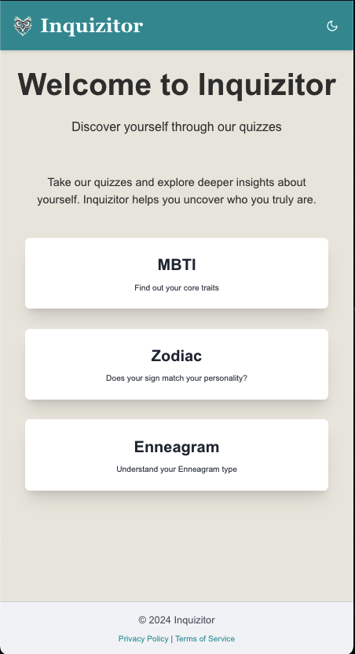

# Inquizitor

**Inquizitor** is a web application offering a variety of interactive personality quizzes, including Myers-Briggs, Zodiac, and Enneagram. Explore your personality through AI-powered, interactive quizzes!

Check out the  [Live Demo](https://inquizitor-six.vercel.app) here

## Features
- **Personality Quiz**: Discover your Myers-Briggs personality type through a series of questions.
- **Zodiac Quiz**: Find out which zodiac sign best matches your personality.
- **Enneagram Quiz**: Learn about your Enneagram type through detailed questions and analysis.
- **Feedback Prompt**: Users can provide feedback on their quiz results to help improve the accuracy of future quizzes.
- **Responsive Design**: Fully responsive across devices for seamless use on mobile, tablet, and desktop.
- **Dark Mode**: Supports dark mode for better user experience in low-light environments.

## Technologies Used
- **Next.js**: A React framework for building server-side rendered applications.
- **Tailwind CSS**: A utility-first CSS framework for fast and flexible styling.
- **OpenAI API**: Used to generate personalized quiz questions and analyze results.

## Getting Started

### Prerequisites
- **Node.js** (v14 or higher)
- **npm** or **yarn**

### Installation

1. **Clone the repository:**

git clone https://github.com/Quantumcode9/inquizitor.git
cd inquizitor

2.	**Install dependencies:**
npm install
# or
yarn install

3.	**Create an .env.local file in the root directory and add your OpenAI API key:**
OPENAI_API_KEY=your_openai_api_key

4.	**Run the development server:**

npm run dev
# or
yarn dev

### Project Structure

	•	pages/: Contains the main pages of the application.
	•	index.js: The home page.
	•	personality/: The Myers-Briggs personality quiz page.
	•	zodiac/: The Zodiac quiz page.
	•	enneagram/: The Enneagram quiz page.
	•	components/: Reusable components like DarkModeToggle.
	•	context/: Context providers for managing global state.
	•	data/: Static data for quizzes.
	•	public/: Static assets such as images and fonts.
	•	styles/: Global styles and Tailwind CSS configuration.

 ## USAGE 

Interact with Inquizitor via the home page, which links to the different quizzes. Each quiz helps users discover more about themselves through a series of questions powered by AI analysis.

### Contributing

Contributions are welcome! Please open an issue or submit a pull request with your changes.
